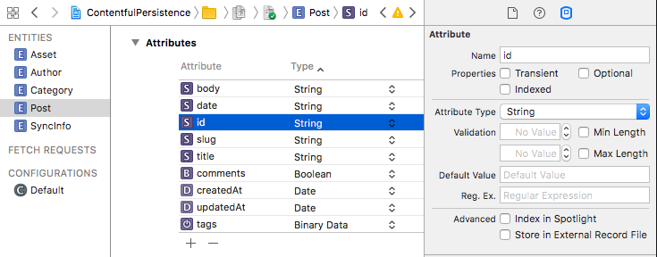
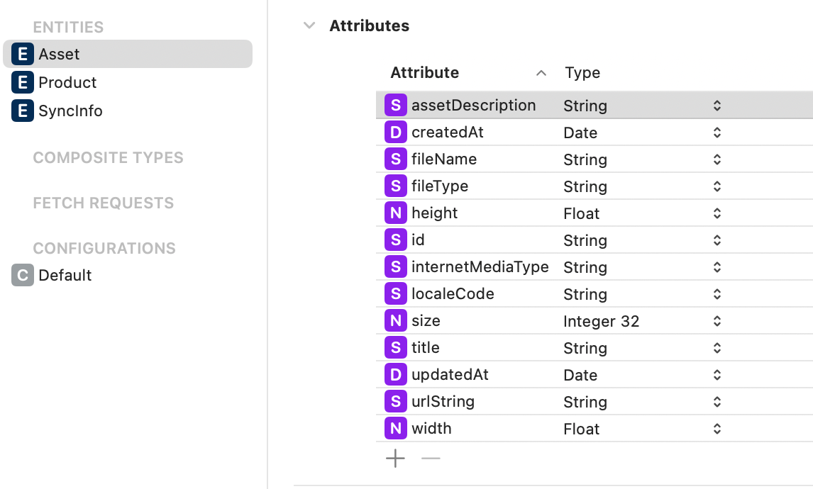
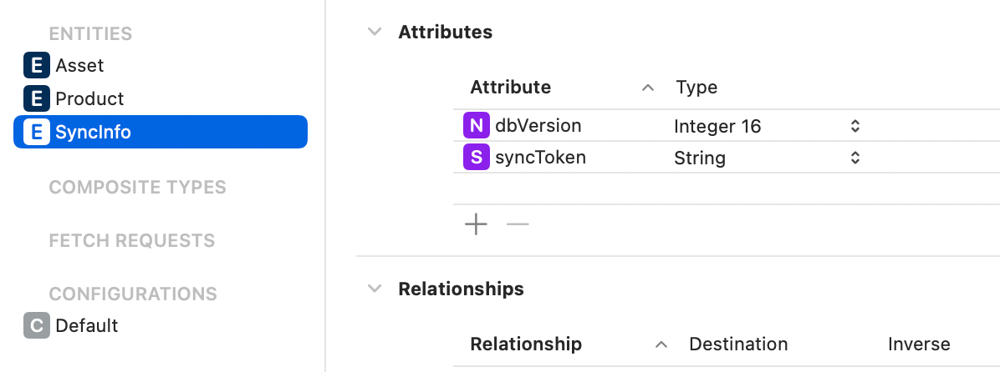
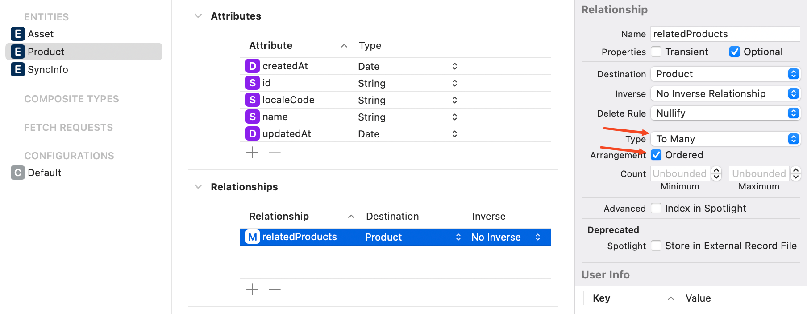

<p align="center">
  <a href="https://www.contentful.com/slack/">
    
  </a>
  &nbsp;
  <a href="https://www.contentfulcommunity.com/">
    
  </a>
</p>

# contentful-persistence.swift - Core Data Offline Persistence for Contentful

> An integration to simplify persisting data from [Contentful](https://www.contentful.com/) to a local Core Data database, built on top of the official [contentful.swift](https://github.com/contentful/contentful.swift) library. It uses the [Sync API](https://www.contentful.com/developers/docs/references/content-delivery-api/#/reference/synchronization) of the Content Delivery API to synchronize all content in a Contentful space to a device and keep it up to date with delta updates.

<p align="center">
  
  &nbsp;
  <a href="LICENSE">
    
  </a>
  &nbsp;
  <a href="https://app.circleci.com/pipelines/github/contentful/contentful-persistence.swift">
    
  </a>
</p>

<p align="center">
  <a href="https://cocoapods.org/pods/ContentfulPersistenceSwift">
    
  </a>
  &nbsp;
  <a href="https://github.com/Carthage/Carthage">
    
  </a>
  &nbsp;
  <a href="https://swift.org/package-manager/">
    
  </a>
  &nbsp;
  <a href="https://swift.org/package-manager/">
    
  </a>
  &nbsp;
</p>

**What is Contentful?**

[Contentful](https://www.contentful.com/) provides content infrastructure for digital teams to power websites, apps, and devices. Unlike a CMS, Contentful was built to integrate with the modern software stack. It offers a central hub for structured content, powerful management and delivery APIs, and a customizable web app that enable developers and content creators to ship their products faster.

<details>
<summary>Table of contents</summary>
<!-- TOC -->

- [contentful-persistence.swift - Core Data Offline Persistence for Contentful](#contentful-persistenceswift---core-data-offline-persistence-for-contentful)
  - [Core Features](#core-features)
  - [Getting started](#getting-started)
    - [Requirements](#requirements)
    - [Installation](#installation)
      - [Swift Package Manager](#swift-package-manager)
      - [CocoaPods](#cocoapods)
      - [Carthage](#carthage)
    - [Your first sync](#your-first-sync)
  - [Using the SDK](#using-the-sdk)
    - [Define your Core Data model](#define-your-core-data-model)
    - [SpaceType and AssetType](#spacetype-and-assettype)
    - [Relationships](#relationships)
    - [Rich text](#rich-text)
    - [Localization](#localization)
  - [Advanced configuration](#advanced-configuration)
    - [Preseeding from a bundled database](#preseeding-from-a-bundled-database)
    - [Preseeding from bundled JSON](#preseeding-from-bundled-json)
    - [Database migrations](#database-migrations)
    - [Custom persistence stores](#custom-persistence-stores)
    - [Privacy manifest](#privacy-manifest)
  - [Documentation & References](#documentation--references)
  - [Reach out to us](#reach-out-to-us)
    - [Have questions about how to use this library?](#have-questions-about-how-to-use-this-library)
    - [You found a bug or want to propose a feature?](#you-found-a-bug-or-want-to-propose-a-feature)
    - [You need to share confidential information or have other questions?](#you-need-to-share-confidential-information-or-have-other-questions)
  - [Get involved](#get-involved)
    - [Development setup](#development-setup)
  - [License](#license)
  - [Code of Conduct](#code-of-conduct)

<!-- /TOC -->

</details>

## Core Features

- Keeps a local Core Data database in sync with a Contentful space using the [Sync API](https://www.contentful.com/developers/docs/references/content-delivery-api/#/reference/synchronization), fetching only what changed since the last sync.
- Maps Contentful entries and assets onto your own `NSManagedObject` subclasses via the `EntryPersistable` and `AssetPersistable` protocols, with automatic or custom field mapping.
- Resolves relationships between entries — including to-one and to-many links — as pages arrive, deferring and caching any links that can't yet be resolved so they complete once the target syncs in (even across app launches).
- [Localization support](https://www.contentful.com/developers/docs/concepts/locales/) via `LocalizationScheme`: persist only the default locale, a single locale, or every locale your space supports.
- Two ways to seed a database before the first network sync: bundling exported Contentful JSON, or shipping a pre-built SQLite file.
- Database versioning with automatic wipe-and-reseed when your bundled schema version increases.
- [Rich Text](https://www.contentful.com/developers/docs/concepts/rich-text/) fields decode into `RichTextDocument`, which conforms to `NSCoding` so it can be stored directly in a Core Data Transformable attribute.
- Zero additional third-party runtime dependencies — the SDK only relies on `Foundation`, `CoreData`, and [contentful.swift](https://github.com/contentful/contentful.swift).
- Ships with a [privacy manifest](PrivacyInfo.xcprivacy) for App Store submissions.

## Getting started

In order to get started with `contentful-persistence.swift`, it's highly recommended that you're already familiar with the [contentful.swift](https://github.com/contentful/contentful.swift) SDK, and with Apple's Core Data framework, since many issues encountered during development are Core Data specific. Read the [Core Data Programming Guide](https://developer.apple.com/library/content/documentation/Cocoa/Conceptual/CoreData/index.html) if you're new to it.

- [Requirements](#requirements)
- [Installation](#installation)
- [Your first sync](#your-first-sync)

### Requirements

| Requirement | Version |
| --- | --- |
| Swift | 5.0 or later |
| Xcode | 26.2+ recommended (CI builds against Xcode 26.2) |
| iOS | 12.0+ |
| macOS | 10.13+ |
| tvOS | 12.0+ |
| watchOS | 4.0+ |

The SDK depends only on [contentful.swift](https://github.com/contentful/contentful.swift) at runtime; it has no other third-party dependencies.

### Installation

#### Swift Package Manager

[Swift Package Manager](https://swift.org/package-manager/) is the recommended way to integrate the SDK. In Xcode, choose **File > Add Package Dependencies…** and enter `https://github.com/contentful/contentful-persistence.swift`, or add the dependency to your `Package.swift` manifest:

```swift
.package(url: "https://github.com/contentful/contentful-persistence.swift", .upToNextMajor(from: "0.18.2"))
```

Then add the product to the targets that need it:

```swift
.target(
    name: "MyApp",
    dependencies: [
        .product(name: "ContentfulPersistence", package: "contentful-persistence.swift")
    ]
)
```

#### CocoaPods

> [!IMPORTANT]
> **CocoaPods is frozen at version 0.18.2.** The [CocoaPods trunk becomes read-only on December 2, 2026](https://blog.cocoapods.org/CocoaPods-Specs-Repo/), so new versions of this library are no longer published to CocoaPods. Existing versions stay installable, and the snippet below keeps working. New releases ship through [Swift Package Manager](#swift-package-manager) and [Carthage](#carthage) only, so please migrate to one of them to get future fixes and features.

```ruby
platform :ios, '12.0'
use_frameworks!
pod 'ContentfulPersistenceSwift', '~> 0.18.2'
```

To learn more about operators for dependency versioning within a Podfile, see the [CocoaPods doc on the Podfile](https://guides.cocoapods.org/using/the-podfile.html).

#### Carthage

Add the following to your `Cartfile`:

```
github "contentful/contentful-persistence.swift" ~> 0.18.2
```

Then build the XCFrameworks:

```bash
carthage update --use-xcframeworks
```

### Your first sync

The `SynchronizationManager` manages the state of your Core Data database and keeps it in sync with the data from your Contentful space:

```swift
import Contentful
import ContentfulPersistence

// Tell the library which of your `NSManagedObject` subclasses conforming to `EntryPersistable`
// should be used when mapping API responses to Core Data entities.
let entryTypes: [EntryPersistable.Type] = [Author.self, Category.self, Post.self]

// Initialize the data store and its schema.
let store = CoreDataStore(context: managedObjectContext)
let persistenceModel = PersistenceModel(spaceType: SyncInfo.self, assetType: Asset.self, entryTypes: entryTypes)

// Initialize the Contentful.Client. Passing it to the manager below wires up the
// `persistenceIntegration` so that sync responses are reported automatically.
let client = Client(spaceId: "<YOUR_SPACE_ID>", accessToken: "<YOUR_DELIVERY_ACCESS_TOKEN>")

// Create the manager.
let syncManager = SynchronizationManager(
    client: client,
    localizationScheme: .all, // Save data for all locales your space supports.
    persistenceStore: store,
    persistenceModel: persistenceModel
)

// Sync with the API. The callback fires once every page of the sync has been persisted.
syncManager.sync { result in
    switch result {
    case .success:
        do {
            let posts: [Post] = try store.fetchAll(type: Post.self, predicate: NSPredicate(value: true))
            print(posts)
        } catch {
            // Handle error thrown by Core Data fetches.
        }
    case .failure(let error):
        print(error)
    }
}
```

To continue syncing from where you left off, simply call `syncManager.sync(then:)` again later — the manager persists and reuses the sync token from your `SyncSpacePersistable` (`SyncInfo` above) automatically.

## Using the SDK

### Define your Core Data model

To integrate your model classes with `contentful-persistence.swift`, conform to `AssetPersistable` for Contentful Assets, or `EntryPersistable` for your own content types. Both protocols extend `ContentSysPersistable`, which requires a non-optional `id` property, plus optional `localeCode`, `createdAt`, and `updatedAt` properties.

Next, create the corresponding entity in your project's `xcdatamodel` file.

**NOTE:** Optionality in Core Data entities differs from Swift optionality. For a Core Data entity, optionality means that a property may be absent when saving to the database. To configure a property's optionality, open the "Data Model Inspector" in Xcode's "Utilities" right sidebar and toggle the "Optional" checkbox.



The mapping of Contentful fields to your entity's properties is derived automatically from matching names, but you can customize it by implementing `static func fieldMapping() -> [FieldName: String]` on your `EntryPersistable` type. This should not include metadata from the `sys` object (e.g. `id`, `createdAt`).

```swift
import Foundation
import CoreData
import ContentfulPersistence
import Contentful

// The following @objc attribute is only necessary if your xcdatamodel Default configuration doesn't have your module
// name prepended to the Swift class. To enable removing the @objc attribute, change the Class for your entity to `ModuleName.Post`.
@objc(Post)
class Post: NSManagedObject, EntryPersistable {

    // The identifier of the corresponding content type in Contentful.
    static let contentTypeId = "post"

    // Properties derived from the `sys` object of Contentful resources.
    @NSManaged var id: String
    @NSManaged var localeCode: String?
    @NSManaged var createdAt: Date?
    @NSManaged var updatedAt: Date?

    // Custom fields on the content type.
    @NSManaged var body: String?
    @NSManaged var comments: NSNumber?
    // NOTE: Unlike date fields in the `sys` object, this library can't store `Date` for custom fields.
    // Use `String` and map to `Date` after fetching from Core Data.
    @NSManaged var customDateField: String?
    @NSManaged var date: Date?
    @NSManaged var slug: String?
    @NSManaged var tags: Data?
    @NSManaged var title: String?
    @NSManaged var authors: NSOrderedSet?
    @NSManaged var category: NSOrderedSet?
    @NSManaged var theFeaturedImage: Asset?

    // Define the mapping from the fields on your Contentful.Entry to your model class.
    // In the example below, only the `title`, `date`, `author`, and `featuredImage` fields are populated.
    static func fieldMapping() -> [FieldName: String] {
        return [
            "title": "title",
            "featuredImage": "theFeaturedImage",
            "author": "authors",
            "date": "date"
        ]
    }
}
```

### SpaceType and AssetType

`PersistenceModel` requires both a `spaceType` and an `assetType`. These correspond to Core Data entities used for storing sync-token metadata (`SyncSpacePersistable`) and Contentful Assets (`AssetPersistable`), respectively.

To function correctly, these types must:

- Be `NSManagedObject` subclasses.
- Conform to `SyncSpacePersistable` and `AssetPersistable`, respectively.
- Be defined as entities in your Core Data `xcdatamodel` file.

```swift
class SyncInfo: NSManagedObject, SyncSpacePersistable {
    @NSManaged var syncToken: String?
    @NSManaged var dbVersion: NSNumber?
}

class Asset: NSManagedObject, AssetPersistable {
    @NSManaged var id: String
    @NSManaged var localeCode: String?
    @NSManaged var title: String?
    @NSManaged var assetDescription: String?
    @NSManaged var urlString: String?
    @NSManaged var createdAt: Date?
    @NSManaged var updatedAt: Date?

    @NSManaged var size: NSNumber?
    @NSManaged var width: NSNumber?
    @NSManaged var height: NSNumber?
    @NSManaged var fileType: String?
    @NSManaged var fileName: String?
}
```

And then in the `xcdatamodeld` file:




### Relationships

Let's say we have the following content model in our Contentful space:

```
Product
- name: String
- relatedProducts: [Product]
```

It represents a product with a name and a list of related products. This translates into a Swift model as follows:

```swift
class Product: NSManagedObject {
    // Contentful metadata.
    @NSManaged var id: String
    @NSManaged var localeCode: String?
    @NSManaged var createdAt: Date?
    @NSManaged var updatedAt: Date?

    // Fields defined on the content type.
    @NSManaged var name: String?
    @NSManaged var relatedProducts: NSOrderedSet?
}

extension Product: EntryPersistable {
    static var contentTypeId = "product"

    static func fieldMapping() -> [FieldName: String] {
        return [
            "name": "name",
            "relatedProducts": "relatedProducts"
        ]
    }
}
```

The corresponding Core Data entity looks like this — note the type and the arrangement set to `Ordered`:



After fetching products from the database, related products can be accessed like this:

```swift
for product in products {
    guard let relatedProductsSet = product.relatedProducts,
          let relatedProducts = relatedProductsSet.array as? [Product] else {
        continue
    }

    for relatedProduct in relatedProducts {
        print("Related product:", relatedProduct.id, relatedProduct.name as Any)
    }
}
```

Relationships that can't be resolved yet — because the target entry hasn't synced down in an earlier page, or belongs to a future sync — are cached to disk and resolved automatically once the target becomes available, including across app launches.

### Rich text

Rich text fields decode into a `RichTextDocument`. Since `RichTextDocument` is an `NSObject` conforming to `NSCoding`, it can be stored directly in a `Transformable` Core Data attribute:

```swift
import CoreData
import Contentful
import ContentfulPersistence

@objc(Article)
class Article: NSManagedObject, EntryPersistable {
    static let contentTypeId = "article"

    @NSManaged var id: String
    @NSManaged var localeCode: String?
    @NSManaged var createdAt: Date?
    @NSManaged var updatedAt: Date?
    @NSManaged var body: RichTextDocument?

    static func fieldMapping() -> [FieldName: String] {
        return [
            "body": "body"
        ]
    }
}
```

Set the attribute's type to `Transformable` in the Core Data model editor. To render the stored document into native views, use [rich-text-renderer.swift](https://github.com/contentful/rich-text-renderer.swift).

### Localization

Configure `SynchronizationManager` with a `LocalizationScheme` to control which locales are persisted:

- `.default` — save entities only for the default locale of your space.
- `.one(localeCode)` — save entities for a single, specific locale.
- `.all` — save entities for every locale your space supports. Remember to include `localeCode` when building predicates against your `Persistable` model classes.

```swift
let syncManager = SynchronizationManager(
    client: client,
    localizationScheme: .one("de-DE"),
    persistenceStore: store,
    persistenceModel: persistenceModel
)
```

If you need to switch from a lightweight initial sync (e.g. `.default`) to persisting every locale afterwards, use the two-phase sync helper, which resets the sync token between phases so all locales are captured on the follow-up pass:

```swift
try syncManager.sync(
    syncSpacePersistable: SyncInfo.self,
    initialLocalizationScheme: .default,
    onInitialCompletion: { result in
        // Called once the default-locale sync finishes.
    },
    onFinalCompletion: { result in
        // Called once the follow-up sync for all locales finishes.
    }
)
```

## Advanced configuration

### Preseeding from a bundled database

You can ship a pre-built SQLite database in your app bundle to avoid an initial network sync entirely. The database is copied into place on two conditions: no database currently exists in the target container folder, or the existing one has a `dbVersion` lower than the one you're providing.

1. Bundle your preseeded database (for example `Test.sqlite`) in your app's main bundle.
2. Use the `SynchronizationManager` initializer that accepts a `PreseedConfiguration`:

    ```swift
    let sqliteContainerFolderPath = <path to the folder where Core Data stores its SQLite files>

    let preseedConfig = PreseedConfiguration(
        resourceName: "Test",                          // Preseeded db name in bundle.
        resourceExtension: "sqlite",                    // Preseeded db extension in bundle.
        sqliteContainerPath: sqliteContainerFolderPath,  // Folder Core Data creates to store the sqlite file.
        dbVersion: 2                                     // New version (must be greater than the existing one, if any).
    )

    let syncManager = try SynchronizationManager(
        client: client,
        localizationScheme: .all,
        persistenceStore: store,
        persistenceModel: persistenceModel,
        preseedConfig: preseedConfig
    )
    ```

3. On initialization, the SDK checks whether the SQLite file already exists at the target path. If it doesn't — or if it exists but its `dbVersion` is lower than `preseedConfig.dbVersion` — the bundled file is copied into place and the new version is recorded.

If you're using a custom `PersistenceStore` implementation, pass your own `preseedStrategy` parameter (conforming to `PreseedStrategy`) to control exactly how the swap happens; it defaults to `FilePreseedManager`, which uses `FileManager`.

### Preseeding from bundled JSON

Alternatively, seed a database from a directory of exported Contentful JSON files — generated with the [ContentfulBundleSync](https://www.contentful.com/developers/docs/references/content-delivery-api/) command line interface — rather than a SQLite file:

```swift
try syncManager.seedDBFromJSONFiles(in: "ContentfulExport", in: Bundle.main)
```

Bundled media referenced by your assets can be retrieved with:

```swift
let data = SynchronizationManager.bundledData(for: asset, inDirectoryNamed: "ContentfulExport", in: Bundle.main)
```

### Database migrations

Both preseeding mechanisms rely on the same `dbVersion` stored on your `SyncSpacePersistable` type. Independently of preseeding, calling `sync(dbVersion:then:)` with a higher version number than what's currently stored wipes the entire persistence store (and any cached relationships) before syncing again — useful when you ship a breaking Core Data model change:

```swift
syncManager.sync(dbVersion: SynchronizationManager.DBVersions.default.rawValue) { result in
    // ...
}
```

### Custom persistence stores

`CoreDataStore` is the default `PersistenceStore` implementation, but you can provide your own by conforming to the `PersistenceStore` protocol. If you also want your custom store to support SQLite bundle preseeding, implement `onStorePreseedingWillBegin(at:)` and `onStorePreseedingCompleted(at:)`, which are called immediately before and after the bundled file is swapped in.

### Privacy manifest

The SDK ships [`PrivacyInfo.xcprivacy`](PrivacyInfo.xcprivacy), declaring that it collects no data, performs no tracking, and uses file-timestamp, user-defaults, and system-boot-time APIs only for the reasons Apple permits. When installed via Swift Package Manager or CocoaPods, the manifest is bundled automatically and folds into your app's privacy report.

## Documentation & References

For further information about the underlying REST API, check out the [Content Delivery API Reference Documentation](https://www.contentful.com/developers/docs/references/content-delivery-api/), or browse the [API reference documentation](https://contentful.github.io/contentful-persistence.swift/docs/index.html) for this library, which can also be loaded into Xcode as a Docset.

This library is a companion to [contentful.swift](https://github.com/contentful/contentful.swift); consult its README for details on `Client`, `EntryDecodable`, queries, and the rest of the Content Delivery API surface.

Every released change is recorded in the [CHANGELOG.md](CHANGELOG.md).

## Reach out to us

### Have questions about how to use this library?

* Reach out to our community forum: [](https://support.contentful.com/)
* Jump into our community slack channel: [](https://www.contentful.com/slack/)

### You found a bug or want to propose a feature?

* File an issue here on GitHub: [](https://github.com/contentful/contentful-persistence.swift/issues/new). Make sure to remove any credential from your code before sharing it.

### You need to share confidential information or have other questions?

* File a support ticket at our Contentful Customer Support: [](https://www.contentful.com/support/)

## Get involved

[](http://makeapullrequest.com)

We appreciate any help on our repositories. For more details about how to contribute, see the [contributing guide](https://github.com/contentful/contentful.swift/blob/master/Contributing.md) for our Swift SDKs.

### Development setup

Development happens in Xcode on macOS, since iOS, macOS, tvOS, and watchOS all have to stay supported. [Homebrew](https://brew.sh/) is a prerequisite.

```bash
make setup_env                      # Install or update the required brew packages.
bundle install                      # Install the Ruby gems used for linting, docs, and coverage.
carthage bootstrap --use-xcframeworks  # Build the dependencies pinned in Cartfile.resolved.
make open                           # Open ContentfulPersistence.xcworkspace.
```

Common tasks:

| Command | Purpose |
| --- | --- |
| `make test` | Run the test suite on macOS. |
| `bundle exec fastlane test_ios` | Run the test suite on iOS (also `test_macos`, `test_tvos`). |
| `bundle exec fastlane build` | Verify the package builds with `swift build`. |
| `make lint` | Run SwiftLint and the CocoaPods podspec linter. |
| `make coverage` | Generate a code-coverage report with Slather. |
| `make carthage` | Build and zip `ContentfulPersistence.xcframework` across all platforms. |
| `./Scripts/set-version.sh 0.18.3` | Update the version in `Config.xcconfig` and `.env` together. |

Pull requests are validated on CircleCI against Xcode 26.2.

Releases are cut from `master` by CircleCI when a maintainer triggers the release pipeline. See [RELEASING.md](RELEASING.md).

## License

This repository is published under the [MIT](LICENSE) license.

## Code of Conduct

We want to provide a safe, inclusive, welcoming, and harassment-free space and experience for all participants, regardless of gender identity and expression, sexual orientation, disability, physical appearance, socioeconomic status, body size, ethnicity, nationality, level of experience, age, religion (or lack thereof), or other identity markers.

[Read our full Code of Conduct](https://github.com/contentful-developer-relations/community-code-of-conduct).
