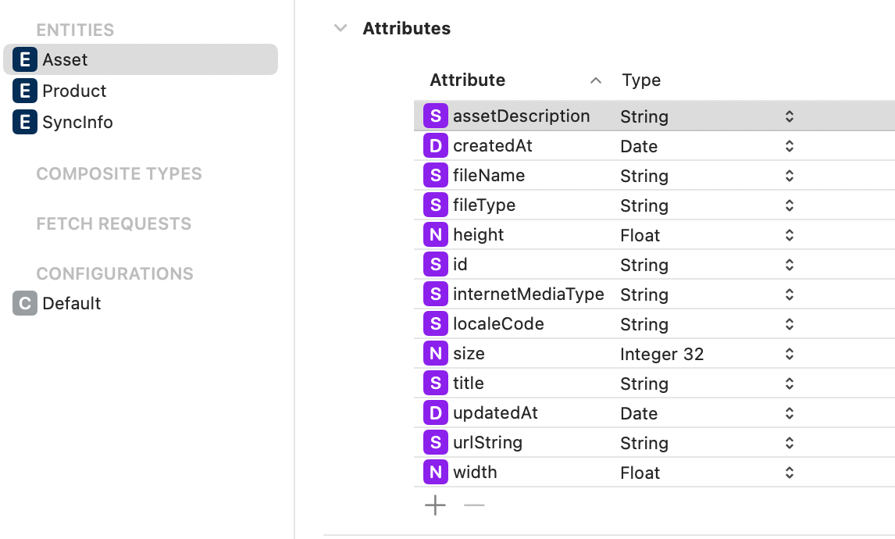
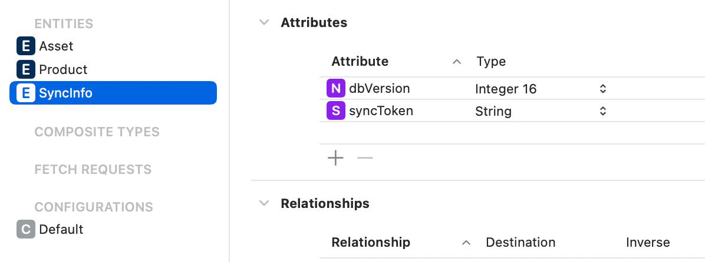
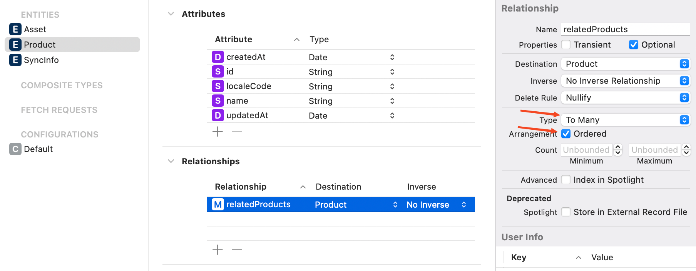

# contentful-persistence.swift

[](http://cocoadocs.org/docsets/ContentfulPersistenceSwift)
[](https://github.com/Carthage/Carthage)
[](http://cocoadocs.org/docsets/ContentfulPersistenceSwift)
[](http://cocoadocs.org/docsets/ContentfulPersistenceSwift)
[](https://travis-ci.org/contentful/contentful-persistence.swift)
[](https://coveralls.io/github/contentful/contentful-persistence.swift)

> An integration to simplify persisting data from [Contentful][1] to a local CoreData database; built on top of the official Contentful [Swift Library][2]. This library specifically uses the [`/sync` endpoint][7] of the Content Delivery API to synchronize all content in a Contentful space to a device.

**What is Contentful?**

[Contentful][1] provides a content infrastructure for digital teams to power content in websites, apps, and devices. Unlike a CMS, Contentful was built to integrate with the modern software stack. It offers a central hub for structured content, powerful management and delivery APIs, and a customizable web app that enables developers and content creators to ship digital products faster.

## Getting Started

### Prerequisites

Before getting started, it is highly recommended that you familiarize yourself with Apple's CoreData framework as many issues encountered during development may be CoreData specific. Read the [CoreData Programming Guide](https://developer.apple.com/library/content/documentation/Cocoa/Conceptual/CoreData/index.html) and check out other (non-Contentful) examples.

### Usage

The `SynchronizationManager` manages the state of your CoreData database and keeps it in sync with the data from your Contentful Space:

```swift
// Tell the library which of your `NSManagedObject` subclasses that conform to `EntryPersistable` should be used when mapping API responses to CoreData entities.
let entryTypes = [Author.self, Category.self, Post.self]

// Initialize the data store and it's schema.
let store = CoreDataStore(context: self.managedObjectContext)
let persistenceModel = PersistenceModel(spaceType: SyncInfo.self, assetType: Asset.self, entryTypes: entryTypes)

// Initialize the Contentful.Client with a persistenceIntegration which will receive messages about changes when calling `sync methods`
self.client = Client(spaceId: "<YOUR_SPACE_ID>", accessToken: "<YOUR_ACCESS_TOKEN>")

// Create the manager.
self.syncManager = SynchronizationManager(
    client: self.client,
    localizationScheme: LocalizationScheme.all, // Save data for all locales your space supports.
    persistenceStore: self.store,
    persistenceModel: persistenceModel
)

// Sync with the API.
self.syncManager.sync { _ in
  do {
    // Fetch all `Posts` from CoreData
    let post: Post? = try self.store.fetchAll(type: Post.self, predicate: NSPredicate(value: true))
  } catch {
    // Handle error thrown by CoreData fetches.
  }
}
```

### SpaceType and AssetType

The `PersistenceModel` requires both a `spaceType` and an `assetType` to be specified. These correspond to Core Data entities used for storing `SyncInfo` and `Asset` objects, respectively.

To function correctly, these objects must:

- Be of type `NSManagedObject`.
- Conform to the `SyncSpacePersistable` and `AssetPersistable` protocols, as appropriate.
- Be defined within the Core Data `xcdatamodel` file.

#### Example Implementation

```swift
class SyncInfo: NSManagedObject, SyncSpacePersistable {
    @NSManaged var syncToken: String?
    @NSManaged var dbVersion: NSNumber?
}

class Asset: NSManagedObject, AssetPersistable {
    @NSManaged var id: String
    @NSManaged var localeCode: String?
    @NSManaged var title: String?
    @NSManaged var assetDescription: String?
    @NSManaged var urlString: String?
    @NSManaged var createdAt: Date?
    @NSManaged var updatedAt: Date?

    @NSManaged var size: NSNumber?
    @NSManaged var width: NSNumber?
    @NSManaged var height: NSNumber?
    @NSManaged var fileType: String?
    @NSManaged var fileName: String?
}
```

And then in the `xcdatamodeld` file:



## Define Your `CoreData` Model

To integrate your model classes with `contentful-persistence.swift`, you must conform to either the `AssetPersistable` protocol for Contentful Assets or the `EntryPersistable` protocol for Contentful entry types.

Next, you'll need to create the corresponding model in your project's `xcdatamodel` file. Both `EntryPersistable` and `AssetPersistable` types require a _non-optional_ `id` property, as well as optional `localeCode`, `createdAt`, and `updatedAt` properties.

**NOTE:** Optionality in Core Data entities differs from Swift optionality. For Core Data entities, optionality means that a property may be absent during a save-to-database operation. To configure a property's optionality, open the "Data Model Inspector" in Xcode's "Utilities" right sidebar and toggle the "Optional" checkbox.


The mapping of Contentful fields to your data model entities will be derived automatically, but you can also customize it by implementing the `static func fieldMapping() -> [FieldName: String]?` on your class.

Below is an example of a model class.

```swift
import Foundation
import CoreData
import ContentfulPersistence
import Contentful

// The following @objc attribute is only necessary if your xcdatamodel Default configuration doesn't have your module
// name prepended to the Swift class. To enable removing the @objc attribute, change the Class for your entity to `ModuleName.Post`
@objc(Post)
class Post: NSManagedObject, EntryPersistable {

    // The identifier of the corresponding Content Type in Contentful.
    static let contentTypeId = "post"

    // Properties of the `sys` object of Contentful resources.
    @NSManaged var id: String
    @NSManaged var localeCode: String?
    @NSManaged var createdAt: Date?
    @NSManaged var updatedAt: Date?

    // Custom fields on the content type.
    @NSManaged var body: String?
    @NSManaged var comments: NSNumber?
    // NOTE: Unlike date fields in sys properties, this library can't store `Date` for custom fields.
    // Use `String` and map to date after fetching from CoreData
    @NSManaged var customDateField: String?
    @NSManaged var date: Date?
    @NSManaged var slug: String?
    @NSManaged var tags: Data?
    @NSManaged var title: String?
    @NSManaged var authors: NSOrderedSet?
    @NSManaged var category: NSOrderedSet?
    @NSManaged var theFeaturedImage: Asset?

    // Define the mapping from the fields on your Contentful.Entry to your model class.
    // In the below example, only the `title`, `date` and `author` fields and `featuredImage` link will be populated.
    // IMPORTANT: This should not include metadata from the `sys` object (e.g. id, createdAt, etc.)
    static func fieldMapping() -> [FieldName: String] {
        return [
            "title": "title",
            "featuredImage": "theFeaturedImage",
            "author": "authors"
            "date": "date"
        ]
    }
}
```

## Relationships

Let's say we have the following content model in our Contentful space:

```
Product
- name: String
- relatedProducts: [Product]
```

It represents a product with a name and related products.
This would be translated into our Swift model as follows:

```swift
class Product: NSManagedObject {
    // Contentful metadata
    @NSManaged var id: String
    @NSManaged var localeCode: String?
    @NSManaged var createdAt: Date?
    @NSManaged var updatedAt: Date?

    // Defined properties in Contentful
    @NSManaged public var name: String?
    @NSManaged public var relatedProducts: NSOrderedSet?
}

extension Product: EntryPersistable {
    public static var contentTypeId = "product"
    public static func fieldMapping() -> [FieldName: String] {
        return [
            "name": "name",
            "relatedProducts": "relatedProducts",
        ]
    }
}
```

The corresponding CoreData entity would look like this:


Note the type and the arrangement set to `ordered`.

After fetching products from the DB, related products could be accessed like this:

```swift
for product in products {
  if let relatedProductsSet = product.relatedProducts,
      let productsArray = relatedProductsSet.array as? [Product]
  {
      // productsArray is now [Product]
      for product in productsArray {
          // Access product properties here, e.g., product.name
          print("Related product:", product.id, product.name)
      }
  } else {
      print("No related products or unable to cast")
  }
}
```

## Preseeding from bundled database

You can provide preseeded database to be copied and used as the end storage. The following example will be for core data, but there can be any custom implementation. Database will be coppied on two conditions: there is no database in the container folder initially or there is one, but dbVersion value is less than the currently provided one.

Follow the steps to provide the custom preseeded database when initializing SDK:

1. Lets say you have Test.sqlite preseeded database in your main bundle.

2. 
   Follow the usual SDK initialization but use a new SynchronizationManager constructor method parameter:

   ```swift
   let sqliteContainerFolderPath = <path to final folder where the sqlite would be initialized by core data>
   let preseedConfig = PreseedConfiguration(resourceName: "Test", // preseeded db name in bundle
                                            resourceExtension: "sqlite", // preseeded db extension in bundle
                                            sqliteContainerPath: sqliteContainerFolderPath, // Folder that core data creates to store sqlite
                                            dbVersion: 2) // New version of the database (should be more than in existing one if app has sqlite db already)
   
   self.syncManager = SynchronizationManager(
       client: self.client,
       localizationScheme: LocalizationScheme.all, // Save data for all locales your space supports.
       persistenceStore: self.store,
       persistenceModel: persistenceModel,
       preseedConfig: preseedConfig
   )
   ```

3. On SDK initialization it will check if the sqlite file already exists in the folder profided, if not - it will copy the bundled db to that location and set the db version on it. Also, if file already exists but version is lower - the same will happen.

If you were using custom database implementation there is additional parameter on SDK initializer called `preseedStrategy` where you can pass an object defining how the migration of the databases would happen. By default it uses the file manager.

## Installation

### SPM installation

You can also use the Swift Package Manager which is bundled with your XCode (Swift 3.0+) to add Contentful Persistence as a dependency to your project. In order to do so, select your project, change tabs to 'Package Dependencies' and add the following URL:

```

https://github.com/contentful/contentful-persistence.swift

```

You need to use "master" branch.

### CocoaPods installation

[CocoaPods][5] is the dependency manager for Objective-C and Swift, which automates and simplifies the process of using 3rd-party libraries like the ContentfulPersistence in your projects.

```ruby
platform :ios, '9.3'
use_frameworks!

target :MyApp do
  pod 'ContentfulPersistenceSwift', '~> 0.13.0'
end
```

### Carthage installation

You can also use [Carthage][6] for integration by adding the following to your `Cartfile`:

```
github "contentful/contentful.swift" ~> 0.13.0
```

## Documentation

For further information, check out the [Developer Documentation][4] or browse the [API documentation][3]. The latter can also be loaded into Xcode as a Docset.

## Contributing and development

To get started contributing, clone the project, `cd` into the root directory and run the following: `make setup_env`.

```bash
make setup_env
carthage bootstrap --platform all
```

This command will install all the development dependencies necessary to build the project, and execute the tests. To run the tests from the command line, execute `make test`. Tests should also all run directly from the Xcode app.

## License

Copyright (c) 2018 Contentful GmbH. See [LICENSE](LICENSE) for further details.

[1]: https://www.contentful.com
[2]: https://github.com/contentful/contentful.swift
[3]: http://cocoadocs.org/docsets/ContentfulPersistenceSwift/
[4]: https://www.contentful.com/developers/docs/references/content-delivery-api/
[5]: https://cocoapods.org/
[6]: https://github.com/Carthage/Carthage
[7]: https://www.contentful.com/developers/docs/references/content-delivery-api/#/reference/synchronization
